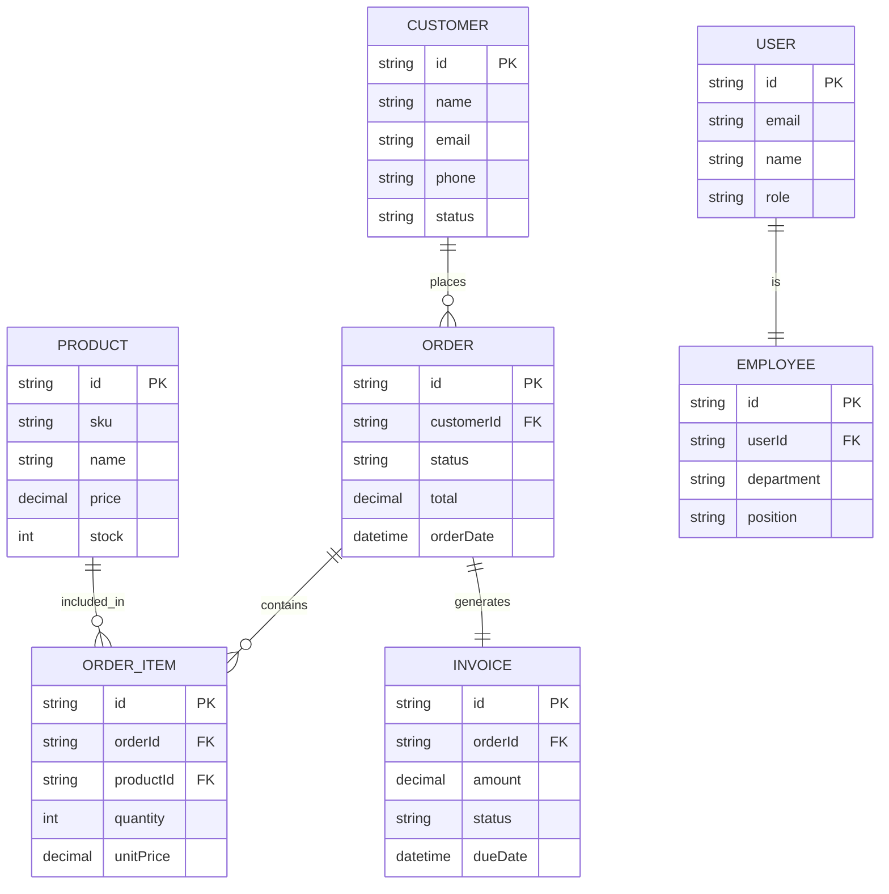

# Simplified ER Diagram - Core Business System

## Core Business Flow

### Main Entities:
- **USER**: System users and authentication
- **CUSTOMER**: Business customers
- **PRODUCT**: Inventory items
- **ORDER**: Customer orders
- **ORDER_ITEM**: Order line items
- **INVOICE**: Billing documents
- **EMPLOYEE**: Staff information

### Key Business Flow:
1. **Customers** place **Orders**
2. **Orders** contain multiple **Order Items** (products)
3. **Orders** generate **Invoices** for billing
4. **Users** are **Employees** who manage the system
