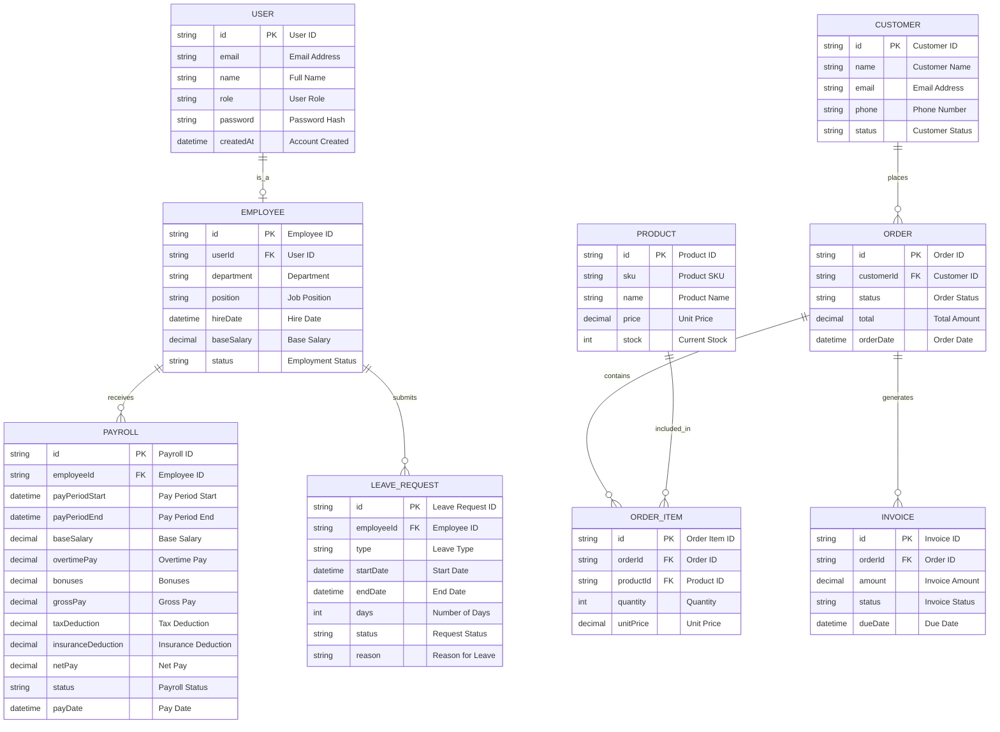

# ER Diagram - Business Management System with HR & Payroll

## Entity Descriptions

### Core Business Entities
- **USER**: System users with authentication
- **CUSTOMER**: Business customers
- **PRODUCT**: Inventory items with pricing and stock
- **ORDER**: Customer orders with status tracking
- **ORDER_ITEM**: Individual items within orders
- **INVOICE**: Billing documents linked to orders

### HR & Payroll
- **EMPLOYEE**: Staff information linked to users with salary details
- **PAYROLL**: Payroll records with salary, overtime, bonuses, and deductions
- **LEAVE_REQUEST**: Employee leave requests and approvals

## Key Business Flows

### Sales Process
1. **Customers** place **Orders**
2. **Orders** contain **Order Items** (products)
3. **Orders** generate **Invoices**

### HR & Payroll Process
1. **Users** become **Employees** with salary information
2. **Employees** receive **Payroll** with various components
3. **Employees** submit **Leave Requests** for time off
